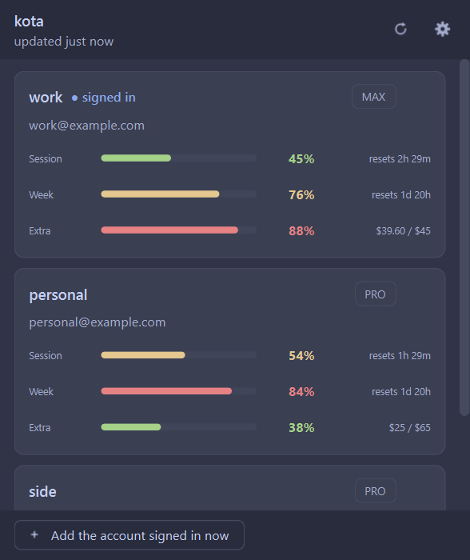
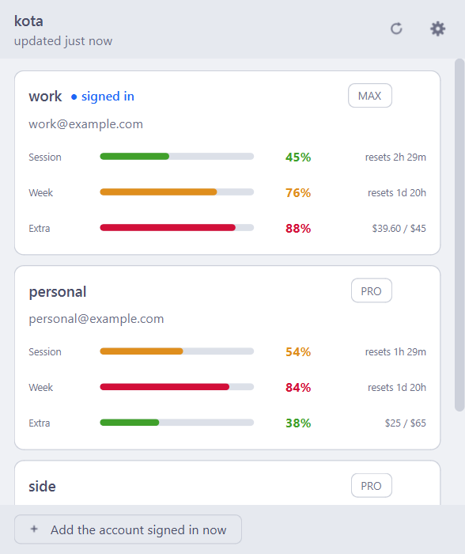
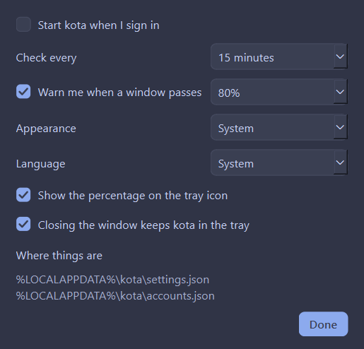

# kota

**Every Claude account you have, in the corner of the screen.**

<p align="center">
  
</p>

<p align="center">
  
  
</p>

*[Türkçe README](README.tr.md)*

How much of the five-hour window and of the week each one has left, what the
extra usage has cost so far, and how long until the next reset, without signing
out of one account to go and look at another.

The tray icon is the reading, not a logo: a ring that fills as your session
does, in green, amber or red. Click it for the window.

Python and PyQt6, and nothing else: no build step, no packages beyond the two,
and nothing of yours leaving the machine.

## Install

```powershell
irm https://raw.githubusercontent.com/ard0x10/kota/main/install.ps1 | iex
```

That puts kota in `%LOCALAPPDATA%\Programs\kota`, adds a Start Menu entry and a
`kota` command, and installs PyQt6 if it is not already there. No
administrator, no PATH edit, nothing outside your own user profile.

From a checkout instead, and everything points at the checkout, so `git pull`
is the whole update:

```powershell
git clone https://github.com/ard0x10/kota
powershell -ExecutionPolicy Bypass -File kota\install.ps1
```

Windows, Python 3.11 or newer, and Claude Code signed in at least once. That
is where kota finds the first account.

To remove it, along with the Start Menu entry and the start-at-sign-in setting.
Your accounts survive unless you add `-Purge`:

```powershell
powershell -ExecutionPolicy Bypass -File install.ps1 -Uninstall
& ([scriptblock]::Create((irm https://raw.githubusercontent.com/ard0x10/kota/main/install.ps1))) -Uninstall
```

## Day to day

Open **kota** from the Start Menu. The first time, it has no accounts, and the
button at the bottom adds whichever one Claude Code is signed in to. Sign in to
the other account and press it again. That is the whole of the setup.

After that nothing needs doing. Every refresh quietly re-reads whoever is
signed in now, so switching accounts the way you already do keeps kota current
on its own, and it notices within half a minute of the switch.

Closing the window leaves kota in the tray. The tray icon opens it again;
right-clicking gives every account's numbers without opening anything.

**Settings** has the parts worth deciding: whether kota starts when you sign in,
how often it looks (five minutes to an hour), the level it warns you at, light
or dark or whatever the desktop is doing, and English or Turkish or whatever the
desktop is set to.

## From a terminal

The window is not the only way in. The same numbers, from the same code:

```
kota                 the table
kota capture         remember the account signed in right now
kota list            the accounts kota knows about
kota remove <name>   forget one
kota json            the same numbers, for a script to read
kota doctor          where everything is, when something is wrong
kota --gui           the window
```

```
    ACCOUNT       SESSION       WEEK          EXTRA           RESETS (5H)
  ----------------------------------------------------------------------------
  > work          ###....  45%  #####..  76%  $39.60 / $45    01:00  2h 30m
    personal      ####...  54%  ######.  84%  $25 / $65       00:00  1h 30m

  Week resets: 20:00  1d 20h
  > = signed in right now
```

`kota json` colours nothing and prints nothing else, which makes it the one to
build on: a status bar, a prompt segment, a scheduled warning when the week
runs thin. `--no-color`, or `NO_COLOR` in the environment, does the same for
the table.

## Your accounts and your tokens

Claude Code keeps the signed-in account's OAuth token in
`~/.claude/.credentials.json`. kota reads that file, asks the API whose token it
is, and files the account under its UUID. By UUID and not by address, so
renaming or reusing an email changes nothing.

The accounts live in `%LOCALAPPDATA%\kota\accounts.json`, with the tokens held
by DPAPI against your Windows user. Copy that file to another machine, or open
it as another user, and the tokens will not come back out. That is the point of
it, and kota treats a token it cannot read as one to capture again rather than
as a crash.

For an account you are *not* signed in to, kota refreshes its access token when
it has expired (they last about eight hours) and writes the result to its own
file and nowhere else.

**kota never writes to `~/.claude/.credentials.json`.** This is the design, not
a courtesy. It runs next to a live Claude Code session, and rotating the
signed-in account's refresh token would sign that session out. So kota never
refreshes the active account at all: it reads the token Claude Code has already
put there and leaves the chain to Claude Code. Two of the tests exist only to
keep that true.

## Not an official tool

kota is not from Anthropic and is not endorsed by them. The three endpoints it
calls are the ones Claude Code itself uses; they are not documented, and they
can change or disappear without warning. It reads your own usage with your own
credentials, and sends nothing anywhere else.

One path has never been watched working end to end: refreshing a *passive*
account whose access token has expired. The address is confirmed: a bad token
there answers `400 invalid_grant`. But a successful refresh through it has not
been observed. If a stale account shows a message where a number should be,
that is the first place to look.

## Other systems

Windows is what kota has been built and tested on. The parts that differ by
system (where the files go, where the tokens are kept, how it starts at
sign-in) are each written for macOS and Linux as well, against the documented
behaviour of the Keychain, `secret-tool` and the autostart directories. None of
that has been run. From a checkout it is `python -m kota`, and reports of what
happens are welcome.

## License

MIT. See [LICENSE](LICENSE).
