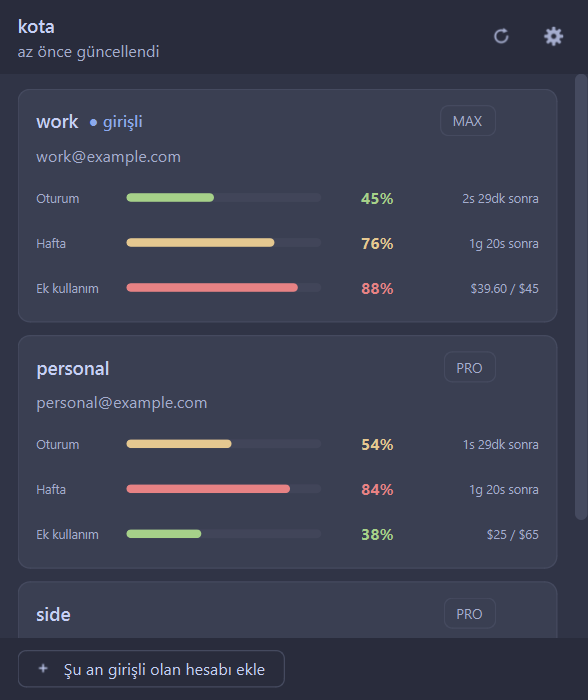

# kota

**Bütün Claude hesapların, ekranın köşesinde.**

<table align="center">
  <tr>
    <td align="center"></td>
    <td align="center"></td>
    <td align="center"></td>
  </tr>
  <tr>
    <td align="center"><sub>Koyu tema</sub></td>
    <td align="center"><sub>Açık tema</sub></td>
    <td align="center"><sub>Ayarlar</sub></td>
  </tr>
</table>

*[English README](README.md)*

Her birinin beş saatlik ve haftalık penceresinden ne kaldığı, ek kullanımın
şimdiye kadar ne tuttuğu, bir sonraki sıfırlanmaya ne var; birinden çıkıp
diğerine bakmaya gerek kalmadan.

Tepsi simgesi bir logo değil, ölçümün kendisi: oturumun doldukça dolan bir
halka; yeşil, sarı, kırmızı. Tıklayınca pencere açılır.

Python ve PyQt6, başka hiçbir şey: derleme adımı yok, bu ikisinin dışında paket
yok, senden hiçbir şey makineden çıkmıyor.

## Kurulum

```powershell
irm https://raw.githubusercontent.com/ard0x10/kota/main/install.ps1 | iex
```

kota'yı `%LOCALAPPDATA%\Programs\kota` altına koyar, Başlat menüsüne bir giriş
ve bir `kota` komutu ekler, PyQt6 yoksa onu da kurar. Yönetici yok, PATH
düzenlemesi yok, kendi kullanıcı profilinin dışına çıkan hiçbir şey yok.

Depodan kurmak istersen her şey o dizini işaret eder, yani güncellemenin tamamı
`git pull`:

```powershell
git clone https://github.com/ard0x10/kota
powershell -ExecutionPolicy Bypass -File kota\install.ps1
```

Windows, Python 3.11 veya üstü, ve Claude Code'a en az bir kez giriş yapılmış
olması. İlk hesabı kota oradan buluyor.

Kaldırmak için; Başlat menüsü girişi ve açılışta başlatma ayarı da gider.
Hesapların `-Purge` eklemedikçe yerinde kalır:

```powershell
powershell -ExecutionPolicy Bypass -File install.ps1 -Uninstall
& ([scriptblock]::Create((irm https://raw.githubusercontent.com/ard0x10/kota/main/install.ps1))) -Uninstall
```

## Gündelik kullanım

Başlat menüsünden **kota**'yı aç. İlk açılışta hiç hesap yoktur; alttaki düğme
Claude Code'un o an girişli olduğu hesabı ekler. Diğer hesaba geç ve düğmeye bir
daha bas. Kurulumun tamamı bu.

Sonrasında yapılacak bir şey yok. Her yenilemede o an kimin girişli olduğu
sessizce yeniden okunur; yani hesabı zaten değiştirdiğin gibi değiştirmen
kota'yı kendiliğinden güncel tutar, üstelik değişikliği yarım dakika içinde
fark eder.

Pencereyi kapatmak kota'yı tepside bırakır. Tepsi simgesi pencereyi geri açar;
sağ tıklayınca hiçbir şey açmadan bütün hesapların sayılarını gösterir.

**Ayarlar** kısmında karar verilmeye değer olanlar var: kota bilgisayarı
açtığında başlasın mı, ne sıklıkla baksın (beş dakikadan bir saate), hangi
eşikte uyarsın, açık mı koyu mu yoksa sistem ne diyorsa o mu, ve İngilizce mi
Türkçe mi yoksa sistemin dili mi.

## Terminalden

Pencere tek yol değil. Aynı sayılar, aynı koddan:

```
kota                 tablo
kota capture         o an girişli olan hesabı hatırla
kota list            kota'nın bildiği hesaplar
kota remove <ad>     birini unut
kota json            aynı sayılar, script'in okuyacağı biçimde
kota doctor          bir şey ters gittiğinde: her şey nerede
kota --gui           pencere
```

```
    ACCOUNT       SESSION       WEEK          EXTRA           RESETS (5H)
  ----------------------------------------------------------------------------
  > work          ###....  45%  #####..  76%  $39.60 / $45    01:00  2h 30m
    personal      ####...  54%  ######.  84%  $25 / $65       00:00  1h 30m

  Week resets: 20:00  1d 20h
  > = signed in right now
```

`kota json` hiçbir şey boyamaz ve başka bir şey yazmaz; üstüne bir şey inşa
edilecekse o kullanılır: durum çubuğu, prompt parçası, hafta incelince uyaran
zamanlanmış bir görev. `--no-color` ya da ortamdaki `NO_COLOR` aynı şeyi tablo
için yapar.

## Hesaplar ve token'lar

Claude Code, girişli hesabın OAuth token'ını `~/.claude/.credentials.json`
içinde tutar. kota o dosyayı okur, API'ye token'ın kime ait olduğunu sorar ve
hesabı UUID'siyle kaydeder; e-posta ile değil UUID ile, çünkü adresin
değişmesi ya da yeniden kullanılması hiçbir şeyi bozmasın.

Hesaplar `%LOCALAPPDATA%\kota\accounts.json` içinde durur; token'ları DPAPI,
Windows kullanıcına bağlı olarak tutar. O dosyayı başka bir makineye kopyala ya
da başka bir kullanıcıyla aç, token'lar geri çıkmaz. Zaten olayı bu, ve kota
okuyamadığı bir token'ı çökme sebebi değil "yeniden yakala" işareti sayar.

Girişli **olmadığın** bir hesap için kota, access token'ın süresi dolmuşsa onu
yeniler (bu token'lar sekiz saat kadar yaşıyor) ve sonucu yalnızca kendi
dosyasına yazar.

**kota `~/.claude/.credentials.json` dosyasına asla yazmaz.** Bu bir incelik
değil, tasarımın kendisi. Yanında açık bir Claude Code oturumu varken çalışıyor
ve girişli hesabın refresh token'ını döndürmek o oturumu düşürür. Bu yüzden kota
aktif hesabı hiç yenilemez: Claude Code'un oraya çoktan koyduğu token'ı okur,
zinciri Claude Code'a bırakır. Testlerden ikisi yalnızca bunun doğru kalması
için var.

## Resmî bir araç değil

kota Anthropic'ten gelmiyor ve Anthropic tarafından onaylanmış değil.
Çağırdığı üç adres, Claude Code'un kendi kullandığı adresler; belgelenmiş
değiller ve haber vermeden değişebilir ya da kaybolabilirler. kota senin
kullanımını senin kimlik bilgilerinle okur, hiçbir yere bir şey göndermez.

Uçtan uca çalıştığı hiç görülmemiş tek bir yol var: access token'ının süresi
dolmuş **pasif** bir hesabın yenilenmesi. Adres doğrulandı: oraya geçersiz bir
token gidince `400 invalid_grant` dönüyor. Ama başarılı bir yenilemenin
gerçekleştiği izlenmedi. Bayat bir hesapta sayı yerine mesaj görürsen ilk
bakılacak yer orası.

## Diğer sistemler

kota'nın üstünde kurulup denendiği sistem Windows. Sisteme göre değişen
parçaların her biri (dosyaların nereye gittiği, token'ların nerede tutulduğu,
açılışta nasıl başladığı) macOS ve Linux için de yazıldı; Keychain,
`secret-tool` ve autostart dizinlerinin belgelenmiş davranışına göre. Ama
hiçbiri çalıştırılmadı. Depodan `python -m kota` ile açılır; ne olduğuna dair
bildirimler memnuniyetle karşılanır.

## Lisans

MIT. Bkz. [LICENSE](LICENSE).
